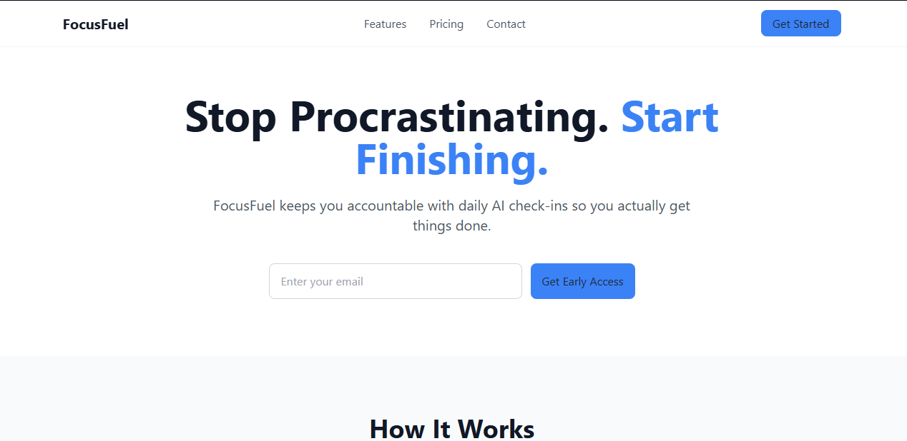

# FocusFuel Landing Page

Hey there! This is a sleek, responsive landing page I built for FocusFuel, an AI-powered tool that helps folks stay on track and actually knock out their daily goals.

I put this together during the Knowinly Internship in the Frontend Track – specifically for Stage One. I really focused on keeping things semantic, the layout clean, and following solid frontend practices.

---

## 📸 Project Screenshot




---

## 🧠 The Idea Behind It

A lot of productivity apps are great at helping you plan what to do, but they kinda drop the ball on actually getting it done.

FocusFuel flips that by adding some real accountability:

* You set your daily goals
* The app checks back in later
* It gently nudges (or gives a little push 😄) to keep you going

The landing page is all about getting this across clearly and hooking visitors with a simple, effective design.

---

## 🎯 What I Built

* ✅ Used semantic HTML like `header`, `main`, `section`, and `footer`
* ✅ Made a responsive nav bar with a mobile menu
* ✅ Created a hero section with a clear call-to-action
* ✅ Added an email signup form with some basic checks
* ✅ Put together a features section highlighting the three main perks
* ✅ Set up a pricing area with three different plans
* ✅ Kept everything looking clean and consistent with TailwindCSS
* ✅ Split things up with separate CSS and JS files for better organization

---

## 🛠️ Tech I Used

* **HTML5** — for the basic structure
* **TailwindCSS (via CDN)** — to handle styling and layout
* **Vanilla JavaScript** — for the interactive bits like the menu and form checks

---

## 📁 How It's Organized

```
FocusFuel/
│
├── index.html
├── css/
│   └── styles.css
├── js/
│   └── script.js
├── assets/
│   └── screenshot.png
└── README.md
```

---

## ⚙️ What It Does

### 📱 Mobile Navigation

* A hamburger menu that works on phones
* JavaScript handles the toggling

### ✉️ Email Validation

* Makes sure you don't submit empty or bogus emails
* Gives you feedback right away

---

## 🎨 Design Vibes

* Went for a clean, SaaS-style look
* Paid attention to spacing, making text easy to read, and keeping things aligned
* Stuck mostly to Tailwind, with just a bit of custom CSS
* Made sure it looks good on mobile first

---

## 🌍 Live Demo

👉 [View Live Demo](https://focusfuelc1.netlify.app)

---

## 📦 Getting It Running

1. Grab the repo:

```bash
git clone https://github.com/your-username/focusfuel-landing-page.git
```

2. Head into the folder:

```bash
cd focusfuel-landing-page
```

3. Just open `index.html` in your browser

---

## 🎓 About the Internship

This was part of the Knowinly Internship – Frontend Engineering Track, Stage One.

### The Goal:

Build a solid landing page from scratch to show off:

* Using semantic HTML properly
* Creating a neat layout with good spacing
* Adding functional parts like nav, forms, and pricing
* Writing code that's easy to read and maintain

---

## 📌 What I Learned

From this project, I got better at:

* Using semantic HTML the right way
* Structuring a real landing page
* Designing clean UIs with TailwindCSS
* Keeping HTML, CSS, and JS separate
* Writing frontend code that's readable and easy to work with

---

## 🙌 Thanks

Big shoutout to the Knowinly Internship Program for giving me a clear path into real frontend work.

---

## 📄 License

This is just for learning purposes.
